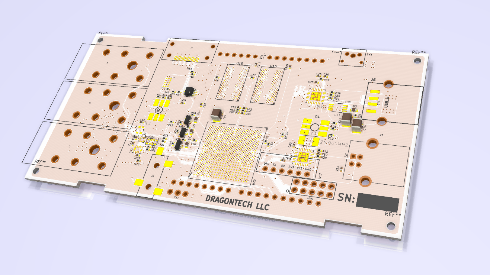
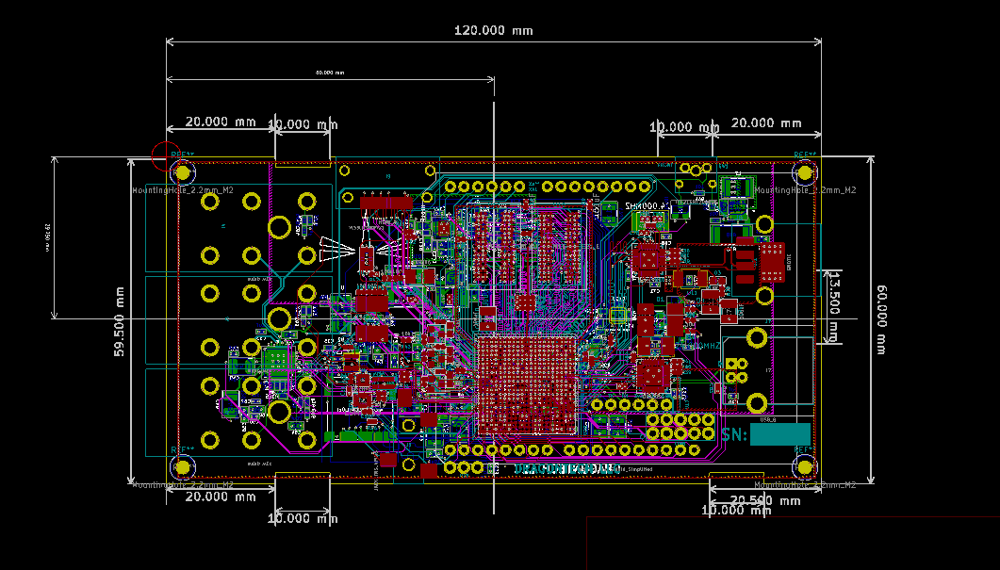
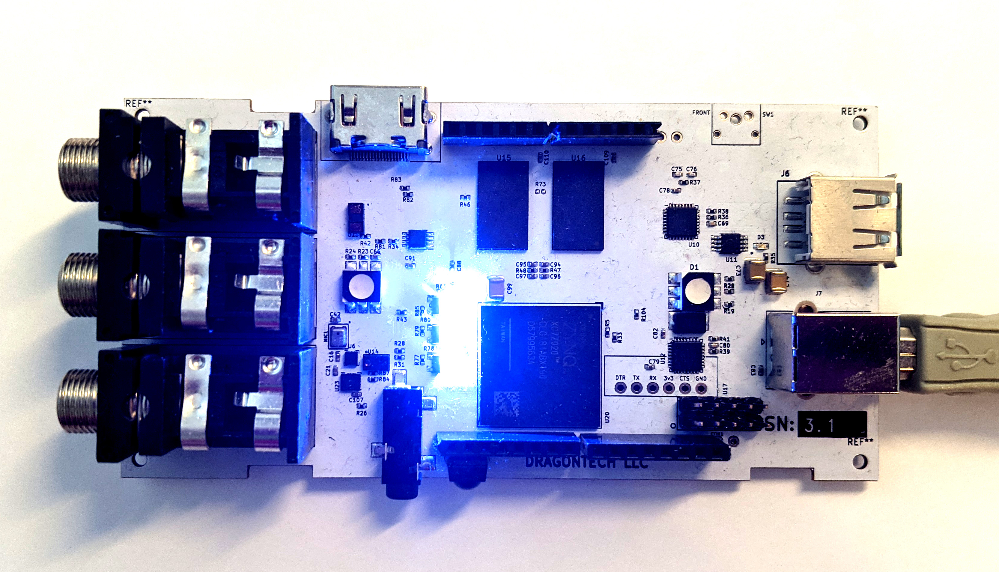
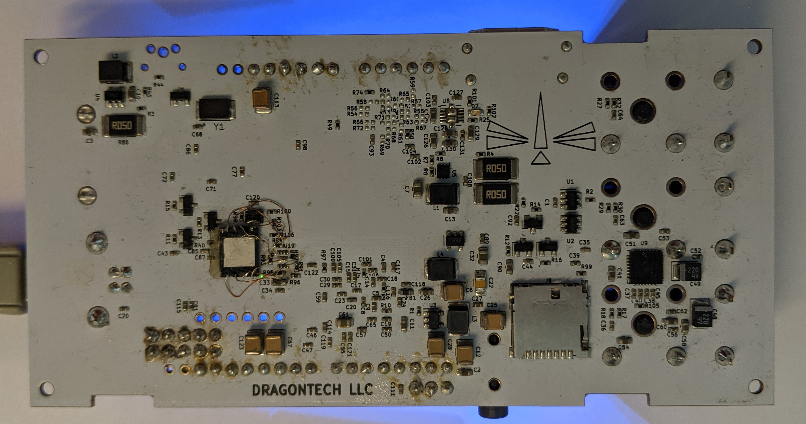

# zynqPCB
An 8-layer board built upon Xilinx Zynq Chip. Includes sound output, HDMI, DDR3, USB Host, USB Device, a handful of sensors, and Arduino Uno style header for screen connection
  
## OPEN TO COLLABORATION!!

# 3D Render

# Layout

# Manufactured PCB - Top

# Manufactured PCB - Bottom

# Introduction  
Hi friends! This is the current status of my 4-year project to make an FPGA-accelerated audio+video synthesizer. I am currently taking a hiatus from this project, and have decided to make the entire PCB design available on Github! Quite a bit of work has been put into this project. The difficult tasks of part selection and routing have been taken care of. I am still testing the functionality of the board. Only one PCB problem has been found: the SPI Flash for Zynq Boot was the wrong footprint! This problem has since been fixed.  

I believe that together we can make this a formidable tool in the open hardware community.  

The following software projects need to be undertaken before this project is usable by the general public:
1. Development of Boot firmware for the SPI flash which loads the linux kernel from the SD card
2. Development of a basic shell block diagram in Vivado  
  
If you embark on one of these projects, please share your code here so other engineers don't have to reproduce your work :)  

# IMPORTANT: Make sure to clone the following into the same directory:
https://github.com/julianfl0w/footprints.pretty  
https://github.com/julianfl0w/lib  
  
## I make no guarantees as to device funtionality. Please review the board carefully before production. 
Specific hardware (from BOM)  
xc7z020clg484 (Zynq Chip)  
VL53L1CXV0FY/1 (rangefinder)  

# Interfaces:  
1. JTAG interface : Functional!
2. SPI Flash : Untested
3. VL53L1CXV0FY Rangefinder : Untested  
4. APDS-9960 Rangefinder : Untested 
5. LIS2HH12 Accelerometer : Untested 
6. LSM6DSLTR IMU  : Untested 
7. HDMI Out : Untested
8. USB Host : Untested
9. USB Device : Untested
10. DDR3 PS Memory : Untested
11. TLV320 Audio Codec : Untested
12. MicroSD card : Untested
